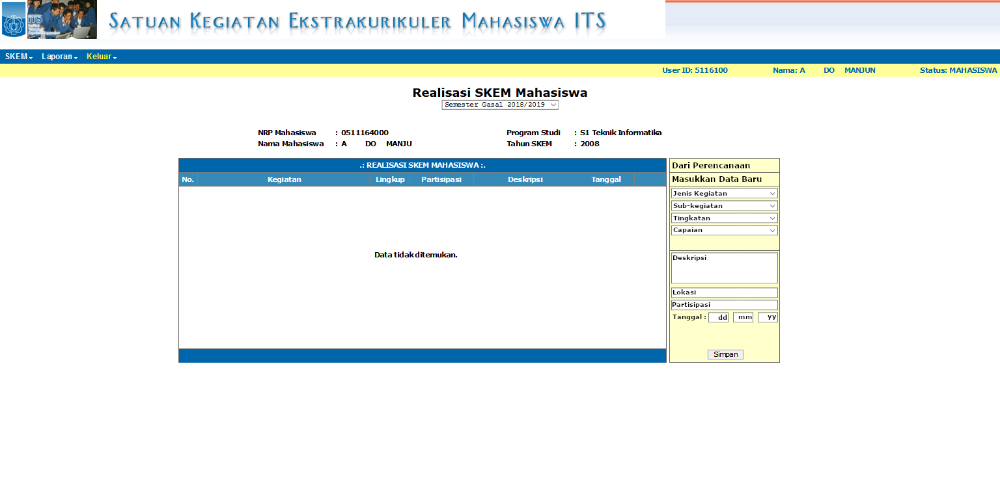
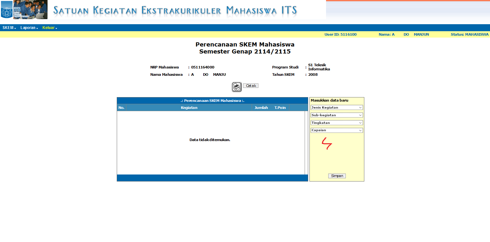
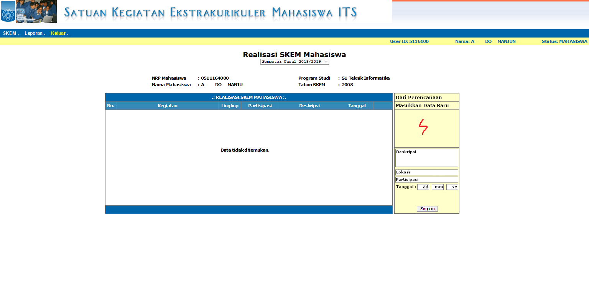
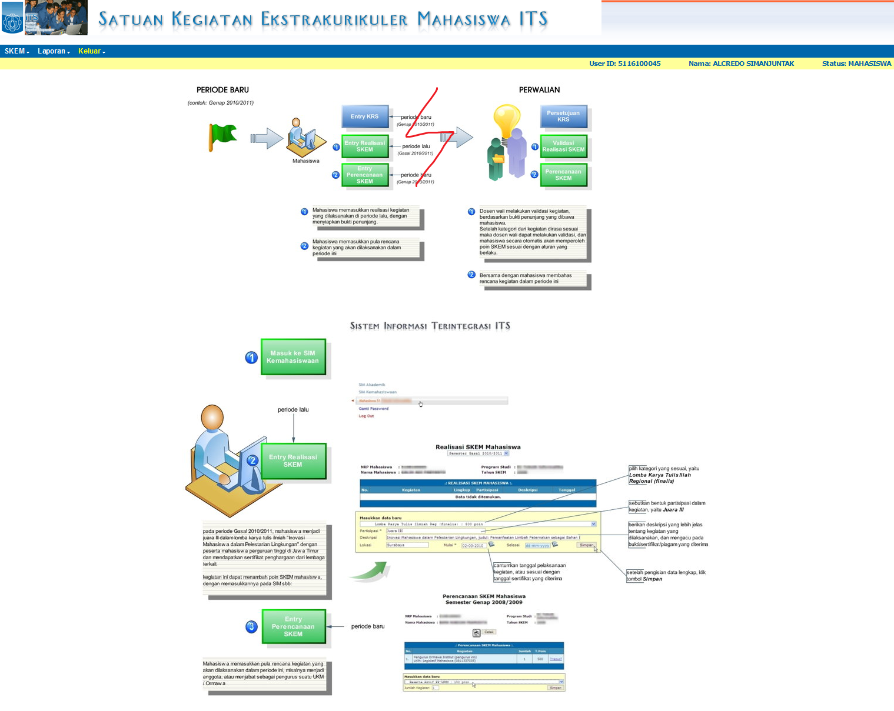
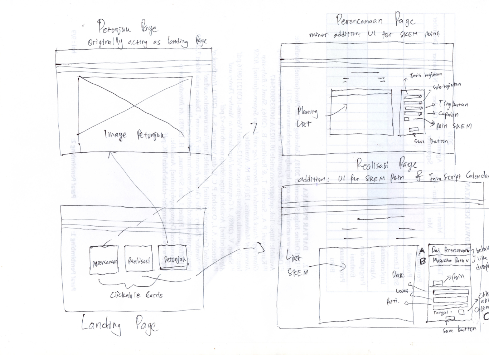
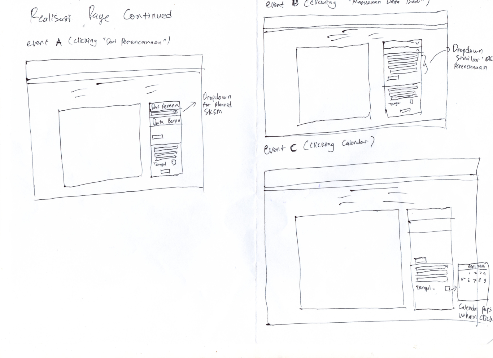

# Usability Evaluation and Prototyping (again)
> Usability Evaluation in this assignment is to evaluate your high-fidelity interactive-prototype with two participants:
> the participant from the previous Contextual Inquiry (CI) 
> and an additional novice-participant with different demographics if possible.
> Respectively, revise your prototype as an attempt to fix any problems found in this Usability Evaluation.

## Operating the Prototype
> Record a video (screen-recording is preferred) while you operating your prototype.
> Present the ideal case on how to interact with the prototype from the beginning to the end.
> Upload the video on any video-sharing website (e.g., YouTube), then attach the video link on this report.

---

## Part A: Usability Evaluation
> In this part, you should prepare your high-fidelity interactive-prototype from the assignment 2.
> Invite the participant from your previous CI to test the prototype.
> You also need to invite one more novice participant.
> As with the CI, you might need to videotape your sessions.
> You can benefit from the videotape while writing your `Recording Transcript` later.

### 1. Brief Description of Participants
> Describe your participants in bullets or sentences.
> The description should contain their demographic (age, gender, occupation),
> their skill level in using the system, and your reasons choosing them.
> The description should NOT contain any personally identifiable information.

#### a. Description of Participant 1 (From Previous Assignment)
 - Student of Physics Engineering Department of ITS  
 - Has several achievements during his study in ITS
 - Has not made any updates in SKEM ITS portal (no achievements has been submitted)  
 - Minor experince with the SKEM Portal

#### b. Description of Participant 2
 - Student of Information System Department of ITS  
 - Proficient in operating computer
 - Has not made any updates in SKEM ITS portal (no achievements has been submitted)  
 - Has no experience in using the SKEM Portal but claims to knowing the Integra's UI pretty well  

### 2. Evaluation Script
> Write the questions you ask and the instructions you use to direct the participants on what to do.
> If it is the same as previous assignments, please mention this, yet go ahead and INCLUDE it again,
> so we have everything in one place.
> Note that the evaluation script must include exactly what you plan to say to the participants.
1. Participant must input plans for current semester's SKEM  
2. Participant must create a new SKEM entry  
3. Participant must create a new SKEM entry, this time based on the SKEM planning   

### 3. Transcript
> Provide a summary of what the participant did and said, and what you did and said.
> If at some points you have to help the participants, because they cannot figure out what to do,
> that scene must be included in the transcript.
> It is not necessary to write down every word the participant said,
> just what is interesting and useful.
> Ensure to write down all the actions on the device, whether correct or wrong.
> Remember to supplement the transcript with time-codes or line-numbers.

#### a. Transcript with Participant 1
 1. **You**: Ketemu lagi, gan. Sorry yo merepotkan.  
 2. **Participant**: Gapapa santai aja. Ini lanjutan tugas yg dulu itu.?
 3. **Y**: Iya. Jadi dulu feedback-mu dulu itu buat acuan bikin prototype. Nah sekarang butuh feedback-mu lagi untuk prototype ini.
 4. **P**: Oh ok. Harus ngapain ini?
 5. **Y**: Sebelum mulai, ini kan cuma prototype, jadi fungsionalitasnya ga mungkin sempurna. Nanti gapapa kalo kamu bikin asumsi atau komentar untuk fitur atau tampilan yang ada, malah aku apresiasi pol.
 6. **P**: Ok, gampang.
 7. **Y**: Sip. Yang pertama, coba bikin perencanaan SKEM. Sama kayak yang dulu.
 8. **P**: Ok. Homepage-nya sama ya? Ya gapapa sih sebenernya. Tapi mungkin agak mengganggu dan menyusahkan aja kalo harus point ke header
 9. **Y**: Hmm. Menurutmu perlu dipermak atau gak? Kira-kira skor prioritasnya gimana?
 10. **P**: Perlu yak, kasian juga kalo ada yang belum lancar browsing gitu. Kalo prioritas mungkin 6/10 sih, jelek parah soalnya.
 11. **Y**: Okok, well noted.
 12. **P**: Ok, lanjut ya. *membuka laman perencanaan* Wih mayan drastis
 13. **Y**: Kesan pertamamu gimana?
 14. **P**: Overall udah ok sih. Udah ga perlu susah-susah scroll dropdown yang panjang. Tapi kayaknya kurang ditambah informasi buat poin SKEM yak
 15. **Y**: Oh iya, kelupaan. Thank you ngingetin. Ada lagi mungkin?
 16. **P**: Ok sih itu aja. Lanjut aja
 17. **Y**: Ok. Sekarang coba bikin realisasi SKEM yak.
 18. **P**: *membuka laman realisasi* Oh desainnya sama, mayan juga sih. Oh kita bisa milih dari yang perencanaan atau bikin baru ya.
 19. **Y**: Yoi. Kira-kira waktu pertama lihat, langsung paham gak? Atau komentar lain mungkin?
 20. **P**: Kalo menurutku ok sih, mayan paham. Mungkin ditambah semacem *arrow* kali yak, biar orang tau kalo itu kayak dropdown. Sama kurang info poin SKEM juga, sama kayak yang tadi.
 21. **Y**: Ok sip. Ada komentar lagi?
 22. **P**: Oh iya, untuk masukin tanggal ini mungkin agak kurang jelas yak, soalnya untuk tahun tulisannya cuman "yy". Nanti orang-orang bingung. Kalo bisa masukinnya pake kayak kalender yang muncul gitu itu, biar ga salah.
 23. **Y**: Oh ya bener juga. Thank you koreksinya. Itu aja komentarmu?
 24. **P**: Yoi. Ada task lagi?
 25. **Y**: Udah itu aja. Sebenernya ada, bikin realisasi SKEM baru tapi berdasar perencanaan. Tapi kayaknya kamu udah nemu caranya. Jadi udah ok sih. Terima kasih banget yo, maaf ngrepotin banget.
 26. **P**: Sans. Sama-sama, gan
 
#### b. Transcript with Participant 2
 - **00:01** 👨‍🔬 You: Lorem Ipsum is simply dummy text of the printing and typesetting industry.
 - **00:10** 👨‍💻 Participant: Lorem Ipsum has been the industry's standard dummy text ever since the 1500s.
 - **00:17** 👨‍🔬 You: when an unknown printer took a galley of type and scrambled it to make a type specimen book.
 - **00:25** 👨‍💻 Participant: The Quick Brown Fox Jumps Over The Lazy Dog.

### 4. Feedback and Incidence Analysis
> Record your observations per prototype screen followed by reference, feedback, incidence, reason, and resolution.

#### OBSERVATION 1

 - **Reference**: Transcript #1 Line number 14 and 20.  
 - **Feedback**: Negative feedback.  
 - **Incidence**: Participant couldn't figure out how much point they get for the SKEM they've input.  
 - **Reason**: There is no UI that signifies how much of point the participant could get.
 - **Resolution**: Create the UI to solve the problem above.  
 
#### OBSERVATION 2

 - **Reference**: Transcript #1 Line number 8.  
 - **Feedback**: Neutral, somewhat negative feedback.  
 - **Reason**: The participant said that the landing page is not intuitive. It is quite troublesome for some people to interact with the page header
 - **Resolution**: Make the landing page better. I'm planning to adopt the dashboard page of Integra to be used in SKEM Portal as well.  
 
#### OBSERVATION 3

 - **Reference**: Transcript #1 Line number 8.  
 - **Feedback**: Negative feedback.  
 - **Incidence**: Trying to input invalid year.  
 - **Reason**: Badly formatted input. The participant was confused for "yy" format or "yyyy" format. "yy" format is weird.  
 - **Resolution**: As the participant suggested himself, adding javascript popup calendar might solve the problem.  
 
 ---

## Part B: Prototyping (again)
> Next, you will need to modify your prototype 
> based on the resolutions you have suggested in `Feedback and Incidence Analysis`'s observations.

### Sketch
> Draw a sketch of your prototype that is refined based according to the aforementioned observations on a paper.
> Afterwards, scan the sketch or make the photograph of it and attach it on this report's section.
> Please make sure the any texts on the sketch are readable.

  
  

### Design Rationale
> Please write a paragraph expressing what you have learned from the usability evaluation, 
> and how it is reflected in your design.

### High-Fidelity Interactive-Prototype
> Create a high-fidelity interactive-prototype based on the `Sketch` you have drawn.
> You can use any prototyping tools: InVision, Adobe XD, or even Microsoft PowerPoint.  

Latest High-Fidelity Prototype: [InVision](https://projects.invisionapp.com/share/RXRR0WT5T69)  
